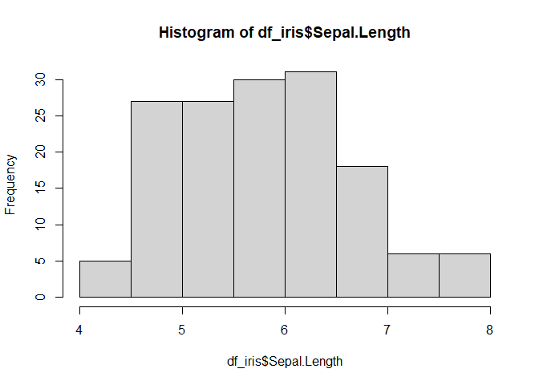
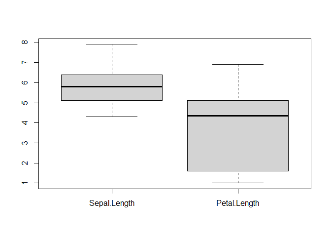

Basic R
================
Ruentong
2025-03-05

## Installation

Basic calculator in R

``` r
1+1
```

    ## [1] 2

``` r
2*3
```

    ## [1] 6

``` r
8/4
```

    ## [1] 2

Basic function

``` r
log(100) #noteไว้เฉยๆไม่มีอะไร
```

    ## [1] 4.60517

``` r
sqrt(9)
```

    ## [1] 3

``` r
exp(5)
```

    ## [1] 148.4132

Create Variable

``` r
# use assign operator (<-) or =
x <- 100 
y <- 200 
one <- 1
Two <- 2
three <- 3
x + y
```

    ## [1] 300

``` r
A= 7
one+Two
```

    ## [1] 3

Data structure

``` r
# vector: a sequence of elements which share the same data type 
scores <- c(80, 99, 90, 72, 55) 
names <- c("David","Jan","Zuu","Tedy")
scores
```

    ## [1] 80 99 90 72 55

``` r
names
```

    ## [1] "David" "Jan"   "Zuu"   "Tedy"

``` r
scores + 10
```

    ## [1]  90 109 100  82  65

``` r
scores <- c(80, 99, 90, 72, 55)
```

``` r
scores <- c(80, 99, 90, 72, 55)
updated <- c(5,2,3,5,7) 
new_scores <- scores + updated
```

``` r
new_scores
```

    ## [1]  85 101  93  77  62

``` r
new_scores[1]
```

    ## [1] 85

``` r
new_scores[1:3]
```

    ## [1]  85 101  93

``` r
new_scores[3:5]
```

    ## [1] 93 77 62

``` r
new_scores[c(2,4)]
```

    ## [1] 101  77

Data type

``` r
# numeric vector 
x <- c(100, 200, 300) 
class(x)
```

    ## [1] "numeric"

``` r
class(names)
```

    ## [1] "character"

``` r
is.numeric(x)
```

    ## [1] TRUE

``` r
is.numeric(names)
```

    ## [1] FALSE

``` r
z<-c(TRUE,FALSE,TRUE,TRUE)
class(z)
```

    ## [1] "logical"

``` r
# create character vector 
animals <- c("Dog", "Cat", "Dog", "Dog", "Hippo") 
class(animals)
```

    ## [1] "character"

``` r
# convert character to factor 
animals_factors <- as.factor(animals) 
class(animals_factors)
```

    ## [1] "factor"

Data frame

``` r
# create three vectors 
students <- c("Joe", "Jason", "Momoa", "Anna", "Mary") 
scores <- c(69, 89, 92, 56, 87) 
grades <- c("C+", "B+", "A", "C", "B+") 
# create a single dataframe 
df <- data.frame(students, scores, grades) 
class(df)
```

    ## [1] "data.frame"

Simple function for Dataframe

``` r
str(df)
```

    ## 'data.frame':    5 obs. of  3 variables:
    ##  $ students: chr  "Joe" "Jason" "Momoa" "Anna" ...
    ##  $ scores  : num  69 89 92 56 87
    ##  $ grades  : chr  "C+" "B+" "A" "C" ...

``` r
head(df) #ดู6ข้อมูลบนสุด
```

    ##   students scores grades
    ## 1      Joe     69     C+
    ## 2    Jason     89     B+
    ## 3    Momoa     92      A
    ## 4     Anna     56      C
    ## 5     Mary     87     B+

``` r
tail(df) 
```

    ##   students scores grades
    ## 1      Joe     69     C+
    ## 2    Jason     89     B+
    ## 3    Momoa     92      A
    ## 4     Anna     56      C
    ## 5     Mary     87     B+

``` r
summary(df)
```

    ##    students             scores        grades         
    ##  Length:5           Min.   :56.0   Length:5          
    ##  Class :character   1st Qu.:69.0   Class :character  
    ##  Mode  :character   Median :87.0   Mode  :character  
    ##                     Mean   :78.6                     
    ##                     3rd Qu.:89.0                     
    ##                     Max.   :92.0

``` r
df_iris=iris
```

``` r
head(df_iris)
```

    ##   Sepal.Length Sepal.Width Petal.Length Petal.Width Species
    ## 1          5.1         3.5          1.4         0.2  setosa
    ## 2          4.9         3.0          1.4         0.2  setosa
    ## 3          4.7         3.2          1.3         0.2  setosa
    ## 4          4.6         3.1          1.5         0.2  setosa
    ## 5          5.0         3.6          1.4         0.2  setosa
    ## 6          5.4         3.9          1.7         0.4  setosa

``` r
str(iris)
```

    ## 'data.frame':    150 obs. of  5 variables:
    ##  $ Sepal.Length: num  5.1 4.9 4.7 4.6 5 5.4 4.6 5 4.4 4.9 ...
    ##  $ Sepal.Width : num  3.5 3 3.2 3.1 3.6 3.9 3.4 3.4 2.9 3.1 ...
    ##  $ Petal.Length: num  1.4 1.4 1.3 1.5 1.4 1.7 1.4 1.5 1.4 1.5 ...
    ##  $ Petal.Width : num  0.2 0.2 0.2 0.2 0.2 0.4 0.3 0.2 0.2 0.1 ...
    ##  $ Species     : Factor w/ 3 levels "setosa","versicolor",..: 1 1 1 1 1 1 1 1 1 1 ...

``` r
summary(df_iris)
```

    ##   Sepal.Length    Sepal.Width     Petal.Length    Petal.Width   
    ##  Min.   :4.300   Min.   :2.000   Min.   :1.000   Min.   :0.100  
    ##  1st Qu.:5.100   1st Qu.:2.800   1st Qu.:1.600   1st Qu.:0.300  
    ##  Median :5.800   Median :3.000   Median :4.350   Median :1.300  
    ##  Mean   :5.843   Mean   :3.057   Mean   :3.758   Mean   :1.199  
    ##  3rd Qu.:6.400   3rd Qu.:3.300   3rd Qu.:5.100   3rd Qu.:1.800  
    ##  Max.   :7.900   Max.   :4.400   Max.   :6.900   Max.   :2.500  
    ##        Species  
    ##  setosa    :50  
    ##  versicolor:50  
    ##  virginica :50  
    ##                 
    ##                 
    ## 

``` r
b <- colnames(df_iris)

rownames(df_iris)
```

    ##   [1] "1"   "2"   "3"   "4"   "5"   "6"   "7"   "8"   "9"   "10"  "11"  "12" 
    ##  [13] "13"  "14"  "15"  "16"  "17"  "18"  "19"  "20"  "21"  "22"  "23"  "24" 
    ##  [25] "25"  "26"  "27"  "28"  "29"  "30"  "31"  "32"  "33"  "34"  "35"  "36" 
    ##  [37] "37"  "38"  "39"  "40"  "41"  "42"  "43"  "44"  "45"  "46"  "47"  "48" 
    ##  [49] "49"  "50"  "51"  "52"  "53"  "54"  "55"  "56"  "57"  "58"  "59"  "60" 
    ##  [61] "61"  "62"  "63"  "64"  "65"  "66"  "67"  "68"  "69"  "70"  "71"  "72" 
    ##  [73] "73"  "74"  "75"  "76"  "77"  "78"  "79"  "80"  "81"  "82"  "83"  "84" 
    ##  [85] "85"  "86"  "87"  "88"  "89"  "90"  "91"  "92"  "93"  "94"  "95"  "96" 
    ##  [97] "97"  "98"  "99"  "100" "101" "102" "103" "104" "105" "106" "107" "108"
    ## [109] "109" "110" "111" "112" "113" "114" "115" "116" "117" "118" "119" "120"
    ## [121] "121" "122" "123" "124" "125" "126" "127" "128" "129" "130" "131" "132"
    ## [133] "133" "134" "135" "136" "137" "138" "139" "140" "141" "142" "143" "144"
    ## [145] "145" "146" "147" "148" "149" "150"

``` r
b
```

    ## [1] "Sepal.Length" "Sepal.Width"  "Petal.Length" "Petal.Width"  "Species"

``` r
b[2] <- "Kaew"
b
```

    ## [1] "Sepal.Length" "Kaew"         "Petal.Length" "Petal.Width"  "Species"

``` r
colnames(df_iris) <-b
```

``` r
df_iris <- iris
```

``` r
df_iris[1:5,1:2]
```

    ##   Sepal.Length Sepal.Width
    ## 1          5.1         3.5
    ## 2          4.9         3.0
    ## 3          4.7         3.2
    ## 4          4.6         3.1
    ## 5          5.0         3.6

``` r
df_iris[1:5,]
```

    ##   Sepal.Length Sepal.Width Petal.Length Petal.Width Species
    ## 1          5.1         3.5          1.4         0.2  setosa
    ## 2          4.9         3.0          1.4         0.2  setosa
    ## 3          4.7         3.2          1.3         0.2  setosa
    ## 4          4.6         3.1          1.5         0.2  setosa
    ## 5          5.0         3.6          1.4         0.2  setosa

``` r
df_iris[20:30,]
```

    ##    Sepal.Length Sepal.Width Petal.Length Petal.Width Species
    ## 20          5.1         3.8          1.5         0.3  setosa
    ## 21          5.4         3.4          1.7         0.2  setosa
    ## 22          5.1         3.7          1.5         0.4  setosa
    ## 23          4.6         3.6          1.0         0.2  setosa
    ## 24          5.1         3.3          1.7         0.5  setosa
    ## 25          4.8         3.4          1.9         0.2  setosa
    ## 26          5.0         3.0          1.6         0.2  setosa
    ## 27          5.0         3.4          1.6         0.4  setosa
    ## 28          5.2         3.5          1.5         0.2  setosa
    ## 29          5.2         3.4          1.4         0.2  setosa
    ## 30          4.7         3.2          1.6         0.2  setosa

``` r
head(df_iris[,"Sepal.Width"])
```

    ## [1] 3.5 3.0 3.2 3.1 3.6 3.9

``` r
head(iris[,c("Sepal.Length","Sepal.Width")])
```

    ##   Sepal.Length Sepal.Width
    ## 1          5.1         3.5
    ## 2          4.9         3.0
    ## 3          4.7         3.2
    ## 4          4.6         3.1
    ## 5          5.0         3.6
    ## 6          5.4         3.9

``` r
library(dplyr)
```

    ## 
    ## Attaching package: 'dplyr'

    ## The following objects are masked from 'package:stats':
    ## 
    ##     filter, lag

    ## The following objects are masked from 'package:base':
    ## 
    ##     intersect, setdiff, setequal, union

``` r
select(df_iris, 1:2)
```

    ##     Sepal.Length Sepal.Width
    ## 1            5.1         3.5
    ## 2            4.9         3.0
    ## 3            4.7         3.2
    ## 4            4.6         3.1
    ## 5            5.0         3.6
    ## 6            5.4         3.9
    ## 7            4.6         3.4
    ## 8            5.0         3.4
    ## 9            4.4         2.9
    ## 10           4.9         3.1
    ## 11           5.4         3.7
    ## 12           4.8         3.4
    ## 13           4.8         3.0
    ## 14           4.3         3.0
    ## 15           5.8         4.0
    ## 16           5.7         4.4
    ## 17           5.4         3.9
    ## 18           5.1         3.5
    ## 19           5.7         3.8
    ## 20           5.1         3.8
    ## 21           5.4         3.4
    ## 22           5.1         3.7
    ## 23           4.6         3.6
    ## 24           5.1         3.3
    ## 25           4.8         3.4
    ## 26           5.0         3.0
    ## 27           5.0         3.4
    ## 28           5.2         3.5
    ## 29           5.2         3.4
    ## 30           4.7         3.2
    ## 31           4.8         3.1
    ## 32           5.4         3.4
    ## 33           5.2         4.1
    ## 34           5.5         4.2
    ## 35           4.9         3.1
    ## 36           5.0         3.2
    ## 37           5.5         3.5
    ## 38           4.9         3.6
    ## 39           4.4         3.0
    ## 40           5.1         3.4
    ## 41           5.0         3.5
    ## 42           4.5         2.3
    ## 43           4.4         3.2
    ## 44           5.0         3.5
    ## 45           5.1         3.8
    ## 46           4.8         3.0
    ## 47           5.1         3.8
    ## 48           4.6         3.2
    ## 49           5.3         3.7
    ## 50           5.0         3.3
    ## 51           7.0         3.2
    ## 52           6.4         3.2
    ## 53           6.9         3.1
    ## 54           5.5         2.3
    ## 55           6.5         2.8
    ## 56           5.7         2.8
    ## 57           6.3         3.3
    ## 58           4.9         2.4
    ## 59           6.6         2.9
    ## 60           5.2         2.7
    ## 61           5.0         2.0
    ## 62           5.9         3.0
    ## 63           6.0         2.2
    ## 64           6.1         2.9
    ## 65           5.6         2.9
    ## 66           6.7         3.1
    ## 67           5.6         3.0
    ## 68           5.8         2.7
    ## 69           6.2         2.2
    ## 70           5.6         2.5
    ## 71           5.9         3.2
    ## 72           6.1         2.8
    ## 73           6.3         2.5
    ## 74           6.1         2.8
    ## 75           6.4         2.9
    ## 76           6.6         3.0
    ## 77           6.8         2.8
    ## 78           6.7         3.0
    ## 79           6.0         2.9
    ## 80           5.7         2.6
    ## 81           5.5         2.4
    ## 82           5.5         2.4
    ## 83           5.8         2.7
    ## 84           6.0         2.7
    ## 85           5.4         3.0
    ## 86           6.0         3.4
    ## 87           6.7         3.1
    ## 88           6.3         2.3
    ## 89           5.6         3.0
    ## 90           5.5         2.5
    ## 91           5.5         2.6
    ## 92           6.1         3.0
    ## 93           5.8         2.6
    ## 94           5.0         2.3
    ## 95           5.6         2.7
    ## 96           5.7         3.0
    ## 97           5.7         2.9
    ## 98           6.2         2.9
    ## 99           5.1         2.5
    ## 100          5.7         2.8
    ## 101          6.3         3.3
    ## 102          5.8         2.7
    ## 103          7.1         3.0
    ## 104          6.3         2.9
    ## 105          6.5         3.0
    ## 106          7.6         3.0
    ## 107          4.9         2.5
    ## 108          7.3         2.9
    ## 109          6.7         2.5
    ## 110          7.2         3.6
    ## 111          6.5         3.2
    ## 112          6.4         2.7
    ## 113          6.8         3.0
    ## 114          5.7         2.5
    ## 115          5.8         2.8
    ## 116          6.4         3.2
    ## 117          6.5         3.0
    ## 118          7.7         3.8
    ## 119          7.7         2.6
    ## 120          6.0         2.2
    ## 121          6.9         3.2
    ## 122          5.6         2.8
    ## 123          7.7         2.8
    ## 124          6.3         2.7
    ## 125          6.7         3.3
    ## 126          7.2         3.2
    ## 127          6.2         2.8
    ## 128          6.1         3.0
    ## 129          6.4         2.8
    ## 130          7.2         3.0
    ## 131          7.4         2.8
    ## 132          7.9         3.8
    ## 133          6.4         2.8
    ## 134          6.3         2.8
    ## 135          6.1         2.6
    ## 136          7.7         3.0
    ## 137          6.3         3.4
    ## 138          6.4         3.1
    ## 139          6.0         3.0
    ## 140          6.9         3.1
    ## 141          6.7         3.1
    ## 142          6.9         3.1
    ## 143          5.8         2.7
    ## 144          6.8         3.2
    ## 145          6.7         3.3
    ## 146          6.7         3.0
    ## 147          6.3         2.5
    ## 148          6.5         3.0
    ## 149          6.2         3.4
    ## 150          5.9         3.0

``` r
select(df_iris, Sepal.Length)
```

    ##     Sepal.Length
    ## 1            5.1
    ## 2            4.9
    ## 3            4.7
    ## 4            4.6
    ## 5            5.0
    ## 6            5.4
    ## 7            4.6
    ## 8            5.0
    ## 9            4.4
    ## 10           4.9
    ## 11           5.4
    ## 12           4.8
    ## 13           4.8
    ## 14           4.3
    ## 15           5.8
    ## 16           5.7
    ## 17           5.4
    ## 18           5.1
    ## 19           5.7
    ## 20           5.1
    ## 21           5.4
    ## 22           5.1
    ## 23           4.6
    ## 24           5.1
    ## 25           4.8
    ## 26           5.0
    ## 27           5.0
    ## 28           5.2
    ## 29           5.2
    ## 30           4.7
    ## 31           4.8
    ## 32           5.4
    ## 33           5.2
    ## 34           5.5
    ## 35           4.9
    ## 36           5.0
    ## 37           5.5
    ## 38           4.9
    ## 39           4.4
    ## 40           5.1
    ## 41           5.0
    ## 42           4.5
    ## 43           4.4
    ## 44           5.0
    ## 45           5.1
    ## 46           4.8
    ## 47           5.1
    ## 48           4.6
    ## 49           5.3
    ## 50           5.0
    ## 51           7.0
    ## 52           6.4
    ## 53           6.9
    ## 54           5.5
    ## 55           6.5
    ## 56           5.7
    ## 57           6.3
    ## 58           4.9
    ## 59           6.6
    ## 60           5.2
    ## 61           5.0
    ## 62           5.9
    ## 63           6.0
    ## 64           6.1
    ## 65           5.6
    ## 66           6.7
    ## 67           5.6
    ## 68           5.8
    ## 69           6.2
    ## 70           5.6
    ## 71           5.9
    ## 72           6.1
    ## 73           6.3
    ## 74           6.1
    ## 75           6.4
    ## 76           6.6
    ## 77           6.8
    ## 78           6.7
    ## 79           6.0
    ## 80           5.7
    ## 81           5.5
    ## 82           5.5
    ## 83           5.8
    ## 84           6.0
    ## 85           5.4
    ## 86           6.0
    ## 87           6.7
    ## 88           6.3
    ## 89           5.6
    ## 90           5.5
    ## 91           5.5
    ## 92           6.1
    ## 93           5.8
    ## 94           5.0
    ## 95           5.6
    ## 96           5.7
    ## 97           5.7
    ## 98           6.2
    ## 99           5.1
    ## 100          5.7
    ## 101          6.3
    ## 102          5.8
    ## 103          7.1
    ## 104          6.3
    ## 105          6.5
    ## 106          7.6
    ## 107          4.9
    ## 108          7.3
    ## 109          6.7
    ## 110          7.2
    ## 111          6.5
    ## 112          6.4
    ## 113          6.8
    ## 114          5.7
    ## 115          5.8
    ## 116          6.4
    ## 117          6.5
    ## 118          7.7
    ## 119          7.7
    ## 120          6.0
    ## 121          6.9
    ## 122          5.6
    ## 123          7.7
    ## 124          6.3
    ## 125          6.7
    ## 126          7.2
    ## 127          6.2
    ## 128          6.1
    ## 129          6.4
    ## 130          7.2
    ## 131          7.4
    ## 132          7.9
    ## 133          6.4
    ## 134          6.3
    ## 135          6.1
    ## 136          7.7
    ## 137          6.3
    ## 138          6.4
    ## 139          6.0
    ## 140          6.9
    ## 141          6.7
    ## 142          6.9
    ## 143          5.8
    ## 144          6.8
    ## 145          6.7
    ## 146          6.7
    ## 147          6.3
    ## 148          6.5
    ## 149          6.2
    ## 150          5.9

``` r
# filter cars with Sepal.Length < 5
filter(iris, Sepal.Length < 5)
```

    ##    Sepal.Length Sepal.Width Petal.Length Petal.Width    Species
    ## 1           4.9         3.0          1.4         0.2     setosa
    ## 2           4.7         3.2          1.3         0.2     setosa
    ## 3           4.6         3.1          1.5         0.2     setosa
    ## 4           4.6         3.4          1.4         0.3     setosa
    ## 5           4.4         2.9          1.4         0.2     setosa
    ## 6           4.9         3.1          1.5         0.1     setosa
    ## 7           4.8         3.4          1.6         0.2     setosa
    ## 8           4.8         3.0          1.4         0.1     setosa
    ## 9           4.3         3.0          1.1         0.1     setosa
    ## 10          4.6         3.6          1.0         0.2     setosa
    ## 11          4.8         3.4          1.9         0.2     setosa
    ## 12          4.7         3.2          1.6         0.2     setosa
    ## 13          4.8         3.1          1.6         0.2     setosa
    ## 14          4.9         3.1          1.5         0.2     setosa
    ## 15          4.9         3.6          1.4         0.1     setosa
    ## 16          4.4         3.0          1.3         0.2     setosa
    ## 17          4.5         2.3          1.3         0.3     setosa
    ## 18          4.4         3.2          1.3         0.2     setosa
    ## 19          4.8         3.0          1.4         0.3     setosa
    ## 20          4.6         3.2          1.4         0.2     setosa
    ## 21          4.9         2.4          3.3         1.0 versicolor
    ## 22          4.9         2.5          4.5         1.7  virginica

``` r
# filter cars with Sepal.Length < 5
filter(iris, Sepal.Length == 5)
```

    ##    Sepal.Length Sepal.Width Petal.Length Petal.Width    Species
    ## 1             5         3.6          1.4         0.2     setosa
    ## 2             5         3.4          1.5         0.2     setosa
    ## 3             5         3.0          1.6         0.2     setosa
    ## 4             5         3.4          1.6         0.4     setosa
    ## 5             5         3.2          1.2         0.2     setosa
    ## 6             5         3.5          1.3         0.3     setosa
    ## 7             5         3.5          1.6         0.6     setosa
    ## 8             5         3.3          1.4         0.2     setosa
    ## 9             5         2.0          3.5         1.0 versicolor
    ## 10            5         2.3          3.3         1.0 versicolor

``` r
# filter cars with Sepal.Length < 5
filter(iris, Sepal.Length != 5)
```

    ##     Sepal.Length Sepal.Width Petal.Length Petal.Width    Species
    ## 1            5.1         3.5          1.4         0.2     setosa
    ## 2            4.9         3.0          1.4         0.2     setosa
    ## 3            4.7         3.2          1.3         0.2     setosa
    ## 4            4.6         3.1          1.5         0.2     setosa
    ## 5            5.4         3.9          1.7         0.4     setosa
    ## 6            4.6         3.4          1.4         0.3     setosa
    ## 7            4.4         2.9          1.4         0.2     setosa
    ## 8            4.9         3.1          1.5         0.1     setosa
    ## 9            5.4         3.7          1.5         0.2     setosa
    ## 10           4.8         3.4          1.6         0.2     setosa
    ## 11           4.8         3.0          1.4         0.1     setosa
    ## 12           4.3         3.0          1.1         0.1     setosa
    ## 13           5.8         4.0          1.2         0.2     setosa
    ## 14           5.7         4.4          1.5         0.4     setosa
    ## 15           5.4         3.9          1.3         0.4     setosa
    ## 16           5.1         3.5          1.4         0.3     setosa
    ## 17           5.7         3.8          1.7         0.3     setosa
    ## 18           5.1         3.8          1.5         0.3     setosa
    ## 19           5.4         3.4          1.7         0.2     setosa
    ## 20           5.1         3.7          1.5         0.4     setosa
    ## 21           4.6         3.6          1.0         0.2     setosa
    ## 22           5.1         3.3          1.7         0.5     setosa
    ## 23           4.8         3.4          1.9         0.2     setosa
    ## 24           5.2         3.5          1.5         0.2     setosa
    ## 25           5.2         3.4          1.4         0.2     setosa
    ## 26           4.7         3.2          1.6         0.2     setosa
    ## 27           4.8         3.1          1.6         0.2     setosa
    ## 28           5.4         3.4          1.5         0.4     setosa
    ## 29           5.2         4.1          1.5         0.1     setosa
    ## 30           5.5         4.2          1.4         0.2     setosa
    ## 31           4.9         3.1          1.5         0.2     setosa
    ## 32           5.5         3.5          1.3         0.2     setosa
    ## 33           4.9         3.6          1.4         0.1     setosa
    ## 34           4.4         3.0          1.3         0.2     setosa
    ## 35           5.1         3.4          1.5         0.2     setosa
    ## 36           4.5         2.3          1.3         0.3     setosa
    ## 37           4.4         3.2          1.3         0.2     setosa
    ## 38           5.1         3.8          1.9         0.4     setosa
    ## 39           4.8         3.0          1.4         0.3     setosa
    ## 40           5.1         3.8          1.6         0.2     setosa
    ## 41           4.6         3.2          1.4         0.2     setosa
    ## 42           5.3         3.7          1.5         0.2     setosa
    ## 43           7.0         3.2          4.7         1.4 versicolor
    ## 44           6.4         3.2          4.5         1.5 versicolor
    ## 45           6.9         3.1          4.9         1.5 versicolor
    ## 46           5.5         2.3          4.0         1.3 versicolor
    ## 47           6.5         2.8          4.6         1.5 versicolor
    ## 48           5.7         2.8          4.5         1.3 versicolor
    ## 49           6.3         3.3          4.7         1.6 versicolor
    ## 50           4.9         2.4          3.3         1.0 versicolor
    ## 51           6.6         2.9          4.6         1.3 versicolor
    ## 52           5.2         2.7          3.9         1.4 versicolor
    ## 53           5.9         3.0          4.2         1.5 versicolor
    ## 54           6.0         2.2          4.0         1.0 versicolor
    ## 55           6.1         2.9          4.7         1.4 versicolor
    ## 56           5.6         2.9          3.6         1.3 versicolor
    ## 57           6.7         3.1          4.4         1.4 versicolor
    ## 58           5.6         3.0          4.5         1.5 versicolor
    ## 59           5.8         2.7          4.1         1.0 versicolor
    ## 60           6.2         2.2          4.5         1.5 versicolor
    ## 61           5.6         2.5          3.9         1.1 versicolor
    ## 62           5.9         3.2          4.8         1.8 versicolor
    ## 63           6.1         2.8          4.0         1.3 versicolor
    ## 64           6.3         2.5          4.9         1.5 versicolor
    ## 65           6.1         2.8          4.7         1.2 versicolor
    ## 66           6.4         2.9          4.3         1.3 versicolor
    ## 67           6.6         3.0          4.4         1.4 versicolor
    ## 68           6.8         2.8          4.8         1.4 versicolor
    ## 69           6.7         3.0          5.0         1.7 versicolor
    ## 70           6.0         2.9          4.5         1.5 versicolor
    ## 71           5.7         2.6          3.5         1.0 versicolor
    ## 72           5.5         2.4          3.8         1.1 versicolor
    ## 73           5.5         2.4          3.7         1.0 versicolor
    ## 74           5.8         2.7          3.9         1.2 versicolor
    ## 75           6.0         2.7          5.1         1.6 versicolor
    ## 76           5.4         3.0          4.5         1.5 versicolor
    ## 77           6.0         3.4          4.5         1.6 versicolor
    ## 78           6.7         3.1          4.7         1.5 versicolor
    ## 79           6.3         2.3          4.4         1.3 versicolor
    ## 80           5.6         3.0          4.1         1.3 versicolor
    ## 81           5.5         2.5          4.0         1.3 versicolor
    ## 82           5.5         2.6          4.4         1.2 versicolor
    ## 83           6.1         3.0          4.6         1.4 versicolor
    ## 84           5.8         2.6          4.0         1.2 versicolor
    ## 85           5.6         2.7          4.2         1.3 versicolor
    ## 86           5.7         3.0          4.2         1.2 versicolor
    ## 87           5.7         2.9          4.2         1.3 versicolor
    ## 88           6.2         2.9          4.3         1.3 versicolor
    ## 89           5.1         2.5          3.0         1.1 versicolor
    ## 90           5.7         2.8          4.1         1.3 versicolor
    ## 91           6.3         3.3          6.0         2.5  virginica
    ## 92           5.8         2.7          5.1         1.9  virginica
    ## 93           7.1         3.0          5.9         2.1  virginica
    ## 94           6.3         2.9          5.6         1.8  virginica
    ## 95           6.5         3.0          5.8         2.2  virginica
    ## 96           7.6         3.0          6.6         2.1  virginica
    ## 97           4.9         2.5          4.5         1.7  virginica
    ## 98           7.3         2.9          6.3         1.8  virginica
    ## 99           6.7         2.5          5.8         1.8  virginica
    ## 100          7.2         3.6          6.1         2.5  virginica
    ## 101          6.5         3.2          5.1         2.0  virginica
    ## 102          6.4         2.7          5.3         1.9  virginica
    ## 103          6.8         3.0          5.5         2.1  virginica
    ## 104          5.7         2.5          5.0         2.0  virginica
    ## 105          5.8         2.8          5.1         2.4  virginica
    ## 106          6.4         3.2          5.3         2.3  virginica
    ## 107          6.5         3.0          5.5         1.8  virginica
    ## 108          7.7         3.8          6.7         2.2  virginica
    ## 109          7.7         2.6          6.9         2.3  virginica
    ## 110          6.0         2.2          5.0         1.5  virginica
    ## 111          6.9         3.2          5.7         2.3  virginica
    ## 112          5.6         2.8          4.9         2.0  virginica
    ## 113          7.7         2.8          6.7         2.0  virginica
    ## 114          6.3         2.7          4.9         1.8  virginica
    ## 115          6.7         3.3          5.7         2.1  virginica
    ## 116          7.2         3.2          6.0         1.8  virginica
    ## 117          6.2         2.8          4.8         1.8  virginica
    ## 118          6.1         3.0          4.9         1.8  virginica
    ## 119          6.4         2.8          5.6         2.1  virginica
    ## 120          7.2         3.0          5.8         1.6  virginica
    ## 121          7.4         2.8          6.1         1.9  virginica
    ## 122          7.9         3.8          6.4         2.0  virginica
    ## 123          6.4         2.8          5.6         2.2  virginica
    ## 124          6.3         2.8          5.1         1.5  virginica
    ## 125          6.1         2.6          5.6         1.4  virginica
    ## 126          7.7         3.0          6.1         2.3  virginica
    ## 127          6.3         3.4          5.6         2.4  virginica
    ## 128          6.4         3.1          5.5         1.8  virginica
    ## 129          6.0         3.0          4.8         1.8  virginica
    ## 130          6.9         3.1          5.4         2.1  virginica
    ## 131          6.7         3.1          5.6         2.4  virginica
    ## 132          6.9         3.1          5.1         2.3  virginica
    ## 133          5.8         2.7          5.1         1.9  virginica
    ## 134          6.8         3.2          5.9         2.3  virginica
    ## 135          6.7         3.3          5.7         2.5  virginica
    ## 136          6.7         3.0          5.2         2.3  virginica
    ## 137          6.3         2.5          5.0         1.9  virginica
    ## 138          6.5         3.0          5.2         2.0  virginica
    ## 139          6.2         3.4          5.4         2.3  virginica
    ## 140          5.9         3.0          5.1         1.8  virginica

``` r
filter(iris, Species == "setosa")
```

    ##    Sepal.Length Sepal.Width Petal.Length Petal.Width Species
    ## 1           5.1         3.5          1.4         0.2  setosa
    ## 2           4.9         3.0          1.4         0.2  setosa
    ## 3           4.7         3.2          1.3         0.2  setosa
    ## 4           4.6         3.1          1.5         0.2  setosa
    ## 5           5.0         3.6          1.4         0.2  setosa
    ## 6           5.4         3.9          1.7         0.4  setosa
    ## 7           4.6         3.4          1.4         0.3  setosa
    ## 8           5.0         3.4          1.5         0.2  setosa
    ## 9           4.4         2.9          1.4         0.2  setosa
    ## 10          4.9         3.1          1.5         0.1  setosa
    ## 11          5.4         3.7          1.5         0.2  setosa
    ## 12          4.8         3.4          1.6         0.2  setosa
    ## 13          4.8         3.0          1.4         0.1  setosa
    ## 14          4.3         3.0          1.1         0.1  setosa
    ## 15          5.8         4.0          1.2         0.2  setosa
    ## 16          5.7         4.4          1.5         0.4  setosa
    ## 17          5.4         3.9          1.3         0.4  setosa
    ## 18          5.1         3.5          1.4         0.3  setosa
    ## 19          5.7         3.8          1.7         0.3  setosa
    ## 20          5.1         3.8          1.5         0.3  setosa
    ## 21          5.4         3.4          1.7         0.2  setosa
    ## 22          5.1         3.7          1.5         0.4  setosa
    ## 23          4.6         3.6          1.0         0.2  setosa
    ## 24          5.1         3.3          1.7         0.5  setosa
    ## 25          4.8         3.4          1.9         0.2  setosa
    ## 26          5.0         3.0          1.6         0.2  setosa
    ## 27          5.0         3.4          1.6         0.4  setosa
    ## 28          5.2         3.5          1.5         0.2  setosa
    ## 29          5.2         3.4          1.4         0.2  setosa
    ## 30          4.7         3.2          1.6         0.2  setosa
    ## 31          4.8         3.1          1.6         0.2  setosa
    ## 32          5.4         3.4          1.5         0.4  setosa
    ## 33          5.2         4.1          1.5         0.1  setosa
    ## 34          5.5         4.2          1.4         0.2  setosa
    ## 35          4.9         3.1          1.5         0.2  setosa
    ## 36          5.0         3.2          1.2         0.2  setosa
    ## 37          5.5         3.5          1.3         0.2  setosa
    ## 38          4.9         3.6          1.4         0.1  setosa
    ## 39          4.4         3.0          1.3         0.2  setosa
    ## 40          5.1         3.4          1.5         0.2  setosa
    ## 41          5.0         3.5          1.3         0.3  setosa
    ## 42          4.5         2.3          1.3         0.3  setosa
    ## 43          4.4         3.2          1.3         0.2  setosa
    ## 44          5.0         3.5          1.6         0.6  setosa
    ## 45          5.1         3.8          1.9         0.4  setosa
    ## 46          4.8         3.0          1.4         0.3  setosa
    ## 47          5.1         3.8          1.6         0.2  setosa
    ## 48          4.6         3.2          1.4         0.2  setosa
    ## 49          5.3         3.7          1.5         0.2  setosa
    ## 50          5.0         3.3          1.4         0.2  setosa

``` r
# see if any numbers <= 300 
numbers <- c(100, 200, 300, 50) 
numbers <= 100
```

    ## [1]  TRUE FALSE FALSE  TRUE

``` r
# this will return FALSE because R is case-sensitive 
"hello" == "Hello" 
```

    ## [1] FALSE

``` r
# sort column hp from low to high 
head(arrange(df_iris, Sepal.Length)) 
```

    ##   Sepal.Length Sepal.Width Petal.Length Petal.Width Species
    ## 1          4.3         3.0          1.1         0.1  setosa
    ## 2          4.4         2.9          1.4         0.2  setosa
    ## 3          4.4         3.0          1.3         0.2  setosa
    ## 4          4.4         3.2          1.3         0.2  setosa
    ## 5          4.5         2.3          1.3         0.3  setosa
    ## 6          4.6         3.1          1.5         0.2  setosa

``` r
# sort column hp from high to low \
head(arrange(df_iris, desc(Sepal.Length)))
```

    ##   Sepal.Length Sepal.Width Petal.Length Petal.Width   Species
    ## 1          7.9         3.8          6.4         2.0 virginica
    ## 2          7.7         3.8          6.7         2.2 virginica
    ## 3          7.7         2.6          6.9         2.3 virginica
    ## 4          7.7         2.8          6.7         2.0 virginica
    ## 5          7.7         3.0          6.1         2.3 virginica
    ## 6          7.6         3.0          6.6         2.1 virginica

``` r
hist(df_iris$Sepal.Length)
```

<!-- -->

``` r
boxplot(df_iris[,c("Sepal.Length", "Petal.Length")])
```

<!-- -->

## R Markdown

This is an R Markdown document. Markdown is a simple formatting syntax
for authoring HTML, PDF, and MS Word documents. For more details on
using R Markdown see <http://rmarkdown.rstudio.com>.

When you click the **Knit** button a document will be generated that
includes both content as well as the output of any embedded R code
chunks within the document. You can embed an R code chunk like this:

``` r
summary(cars)
```

    ##      speed           dist       
    ##  Min.   : 4.0   Min.   :  2.00  
    ##  1st Qu.:12.0   1st Qu.: 26.00  
    ##  Median :15.0   Median : 36.00  
    ##  Mean   :15.4   Mean   : 42.98  
    ##  3rd Qu.:19.0   3rd Qu.: 56.00  
    ##  Max.   :25.0   Max.   :120.00

## Including Plots

You can also embed plots, for example:

<!-- -->

Note that the `echo = FALSE` parameter was added to the code chunk to
prevent printing of the R code that generated the plot.
