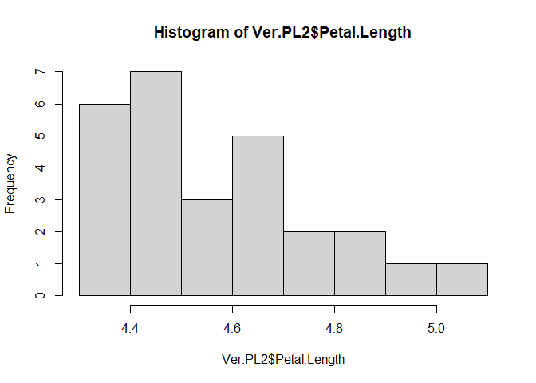
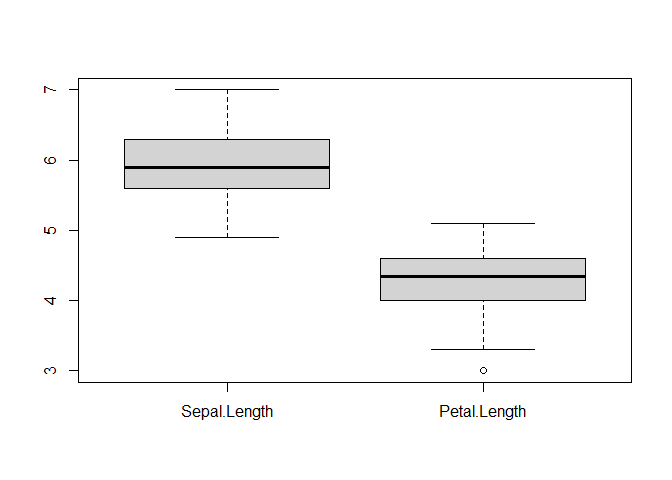

Versicolor
================
Ruentong
2025-03-06

``` r
df_iris <- iris
```

``` r
df_iris[51:100,]
```

    ##     Sepal.Length Sepal.Width Petal.Length Petal.Width    Species
    ## 51           7.0         3.2          4.7         1.4 versicolor
    ## 52           6.4         3.2          4.5         1.5 versicolor
    ## 53           6.9         3.1          4.9         1.5 versicolor
    ## 54           5.5         2.3          4.0         1.3 versicolor
    ## 55           6.5         2.8          4.6         1.5 versicolor
    ## 56           5.7         2.8          4.5         1.3 versicolor
    ## 57           6.3         3.3          4.7         1.6 versicolor
    ## 58           4.9         2.4          3.3         1.0 versicolor
    ## 59           6.6         2.9          4.6         1.3 versicolor
    ## 60           5.2         2.7          3.9         1.4 versicolor
    ## 61           5.0         2.0          3.5         1.0 versicolor
    ## 62           5.9         3.0          4.2         1.5 versicolor
    ## 63           6.0         2.2          4.0         1.0 versicolor
    ## 64           6.1         2.9          4.7         1.4 versicolor
    ## 65           5.6         2.9          3.6         1.3 versicolor
    ## 66           6.7         3.1          4.4         1.4 versicolor
    ## 67           5.6         3.0          4.5         1.5 versicolor
    ## 68           5.8         2.7          4.1         1.0 versicolor
    ## 69           6.2         2.2          4.5         1.5 versicolor
    ## 70           5.6         2.5          3.9         1.1 versicolor
    ## 71           5.9         3.2          4.8         1.8 versicolor
    ## 72           6.1         2.8          4.0         1.3 versicolor
    ## 73           6.3         2.5          4.9         1.5 versicolor
    ## 74           6.1         2.8          4.7         1.2 versicolor
    ## 75           6.4         2.9          4.3         1.3 versicolor
    ## 76           6.6         3.0          4.4         1.4 versicolor
    ## 77           6.8         2.8          4.8         1.4 versicolor
    ## 78           6.7         3.0          5.0         1.7 versicolor
    ## 79           6.0         2.9          4.5         1.5 versicolor
    ## 80           5.7         2.6          3.5         1.0 versicolor
    ## 81           5.5         2.4          3.8         1.1 versicolor
    ## 82           5.5         2.4          3.7         1.0 versicolor
    ## 83           5.8         2.7          3.9         1.2 versicolor
    ## 84           6.0         2.7          5.1         1.6 versicolor
    ## 85           5.4         3.0          4.5         1.5 versicolor
    ## 86           6.0         3.4          4.5         1.6 versicolor
    ## 87           6.7         3.1          4.7         1.5 versicolor
    ## 88           6.3         2.3          4.4         1.3 versicolor
    ## 89           5.6         3.0          4.1         1.3 versicolor
    ## 90           5.5         2.5          4.0         1.3 versicolor
    ## 91           5.5         2.6          4.4         1.2 versicolor
    ## 92           6.1         3.0          4.6         1.4 versicolor
    ## 93           5.8         2.6          4.0         1.2 versicolor
    ## 94           5.0         2.3          3.3         1.0 versicolor
    ## 95           5.6         2.7          4.2         1.3 versicolor
    ## 96           5.7         3.0          4.2         1.2 versicolor
    ## 97           5.7         2.9          4.2         1.3 versicolor
    ## 98           6.2         2.9          4.3         1.3 versicolor
    ## 99           5.1         2.5          3.0         1.1 versicolor
    ## 100          5.7         2.8          4.1         1.3 versicolor

``` r
versicolor=df_iris[51:100,]
df_versicolor = versicolor
summary(df_versicolor)
```

    ##   Sepal.Length    Sepal.Width     Petal.Length   Petal.Width          Species  
    ##  Min.   :4.900   Min.   :2.000   Min.   :3.00   Min.   :1.000   setosa    : 0  
    ##  1st Qu.:5.600   1st Qu.:2.525   1st Qu.:4.00   1st Qu.:1.200   versicolor:50  
    ##  Median :5.900   Median :2.800   Median :4.35   Median :1.300   virginica : 0  
    ##  Mean   :5.936   Mean   :2.770   Mean   :4.26   Mean   :1.326                  
    ##  3rd Qu.:6.300   3rd Qu.:3.000   3rd Qu.:4.60   3rd Qu.:1.500                  
    ##  Max.   :7.000   Max.   :3.400   Max.   :5.10   Max.   :1.800

``` r
dplyr::select(df_versicolor, Petal.Length)
```

    ##     Petal.Length
    ## 51           4.7
    ## 52           4.5
    ## 53           4.9
    ## 54           4.0
    ## 55           4.6
    ## 56           4.5
    ## 57           4.7
    ## 58           3.3
    ## 59           4.6
    ## 60           3.9
    ## 61           3.5
    ## 62           4.2
    ## 63           4.0
    ## 64           4.7
    ## 65           3.6
    ## 66           4.4
    ## 67           4.5
    ## 68           4.1
    ## 69           4.5
    ## 70           3.9
    ## 71           4.8
    ## 72           4.0
    ## 73           4.9
    ## 74           4.7
    ## 75           4.3
    ## 76           4.4
    ## 77           4.8
    ## 78           5.0
    ## 79           4.5
    ## 80           3.5
    ## 81           3.8
    ## 82           3.7
    ## 83           3.9
    ## 84           5.1
    ## 85           4.5
    ## 86           4.5
    ## 87           4.7
    ## 88           4.4
    ## 89           4.1
    ## 90           4.0
    ## 91           4.4
    ## 92           4.6
    ## 93           4.0
    ## 94           3.3
    ## 95           4.2
    ## 96           4.2
    ## 97           4.2
    ## 98           4.3
    ## 99           3.0
    ## 100          4.1

``` r
Ver.PL = dplyr::select(df_versicolor, Petal.Length)
```

``` r
dplyr::filter(Ver.PL, Petal.Length > 4.26)
```

    ##    Petal.Length
    ## 1           4.7
    ## 2           4.5
    ## 3           4.9
    ## 4           4.6
    ## 5           4.5
    ## 6           4.7
    ## 7           4.6
    ## 8           4.7
    ## 9           4.4
    ## 10          4.5
    ## 11          4.5
    ## 12          4.8
    ## 13          4.9
    ## 14          4.7
    ## 15          4.3
    ## 16          4.4
    ## 17          4.8
    ## 18          5.0
    ## 19          4.5
    ## 20          5.1
    ## 21          4.5
    ## 22          4.5
    ## 23          4.7
    ## 24          4.4
    ## 25          4.4
    ## 26          4.6
    ## 27          4.3

``` r
Ver.PL2 = dplyr::filter(Ver.PL, Petal.Length > 4.26)
```

``` r
hist(Ver.PL2$Petal.Length)
```

<!-- -->

``` r
boxplot(versicolor[,c("Sepal.Length", "Petal.Length")])
```

<!-- -->
